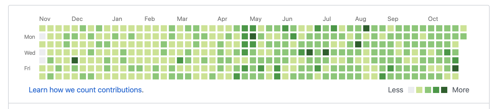

<!-- # Usage

运行以下命令启动：
```bash
npm start
# or
node index
```

效果如下：

 

如果你喜欢或者对你有帮助，给我点个赞支持下吧😊 -->

# Principle

|命令|作用|
|-|-|
|git --amend|简单地来说，可以理解成对最后一次提交做修正|
|git --no-edit||
|git --date|见下文|

有时需要修改上次`git commit`的时间，比如之前将代码提交到本地库中，现在想将这次提交推送到远程仓库，但是这次提交的时间显示还是昨天的时间，下面提供一个办法用于修改上次提交的时间：
使用：

```bash
git commit --amend --date="commit_time"
```
`commit_time`的格式比较难记，不过有个小技巧，我们可以先在命令行输入：

```bash
date -R
Sat, 24 Dec 2016 18:12:09 +0800
```

这个命令的输出格式与`git commit –amend –date`命令要填写的日期格式相同，自己再稍加修改一下即可。
如果我们只是想将上次`git commit`的时间 改为当前时间，可以使用以下两个命令：

```bash
git commit --amend --date="$(date -R)"
# 或
git commit --amend --date=`date -R`
```

对于如何修改任意`git commit`的时间，也简单，按照date -R命令的输出格式自己构造`commit_time`即可。

```bash
git commit --amend --date="Sun, 25 Dec 2016 19:42:09 +0800"
git commit --amend --no-edit --date="Sun, 25 Dec 2016 19:42:09 +0800"
git push origin master --force
```

## date参数

Change history: amending and editing dates
There might be certain situations where you want to alter the timestamps git assigns to commits. There are a couple of ways that you can do this.

Use `--date`

The `--date` option allows you to specify the author date that git attaches to the commit. Here we can’t use approxidate unfortunately, only fixed dates will work `(YYYY.MM.DD, MM/DD/YYYY, DD.MM.YYYY, RFC 2822 and ISO 8601 are all valid)`.
```bash
git commit --date="Wed Feb 16 14:00 2037 +0100"
```
We can also use `amend` to change the timestamp of a previous commit:
```bash
git commit --amend --date="Wed Feb 16 14:00 2037 +0100"
```
Unfortunately `--date` will only change the `GIT_AUTHOR_DATE`, not `GIT_COMMITTER_DATE`. If this is a problem, you may need to…

> Manually set GIT_AUTHOR_DATE and GIT_COMMITTER_DATE

## 时间格式

- rfc2822: `Mon, 3 Jul 2006 17:18:43 +0200`
- iso8601: `2006-07-03 17:18:43 +0200`
- local: `Mon Jul 3 15:18:43 2006`
- short: `2006-07-03 (not in 1.9.1, works in 2.3.0)`
- relative: see commit 34dc6e7:
```bash
5.seconds.ago, 
2.years.3.months.ago, 
'6am yesterday'
```
- raw: see commit 7dff9b3 (git 1.6.2, March 2009)
- internal raw git format - seconds since epoch plus timezone
(put another way: `'date +"%s %z"'` format)

- default: `Mon Jul 3 17:18:43 2006 +0200`
